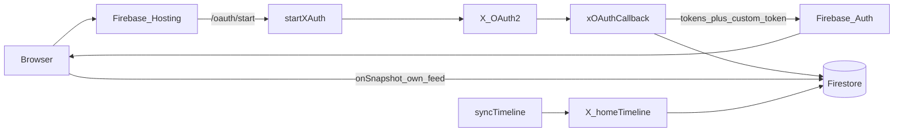

# Architecture

Private friends-and-family **following feeds** backed by the X API (pay-per-use), Firebase Auth (custom tokens), Firestore, Hosting, and Cloud Functions.

Live site: https://mytwitter-feed.web.app  
Firebase project: `mytwitter-feed`

## Goals

- Each member connects **their own** X account and sees **only their** home timeline (original posts + reposts, no replies).
- Site is **private**: only allowlisted handles or invite redeemers can sign in. Feeds are not shared across members.
- Poll X every **10 minutes**; UI updates live via Firestore snapshots (incremental DOM updates).

## High-level flow

## Components

| Piece | Role |
|-------|------|
| [`public/`](../public/) | Static SPA: Auth gate, own feed, info dialog, usage |
| Hosting rewrites | `/oauth/start` → `startXAuth`, `/oauth/callback` → `xOAuthCallback` |
| Cloud Functions | OAuth, invites, scheduled sync, usage metering |
| Firestore | Members, posts, tokens (Admin-only), sync state, allowlist |
| Firebase Auth | Custom tokens only; **Auth uid = X user id** |
| X API | OAuth 2.0 user context + `GET /2/users/:id/timelines/reverse_chronological` (via `homeTimeline`) |

## Auth and membership

1. User opens site (optionally `?invite=CODE`).
2. **Sign in with X** → Hosting `/oauth/start` → `startXAuth` stores PKCE verifier in `oauthSessions/{state}` and redirects to X.
3. X redirects to `/oauth/callback` → `xOAuthCallback`:
   - Exchanges code for access + refresh tokens.
   - Allows join if already a member, handle/`xUserId` on `config/allowlist`, or valid invite.
   - Upserts `members/{xUserId}` and `users/{xUserId}` (tokens).
   - Mints Firebase custom token using `ADMIN_SDK_CREDENTIALS` (local private-key signing; avoids Gen2 `signBlob` IAM issues).
   - Redirects to `/?token=…`; client `signInWithCustomToken` then strips the query.
4. Returning members re-run the same X OAuth path (refreshes API tokens + session).

**Admin:** first allowlist handle (bootstrap default `@billylo`) gets `role: admin` on first join if not already set. Admins call `createInvite` from the info dialog.

## Data model

| Path | Client access | Contents |
|------|---------------|----------|
| `members/{xUserId}` | Read **own** doc | `handle`, `name`, `avatar`, `role`, `enabled`, `joinedAt` |
| `users/{xUserId}` | Admin only | OAuth tokens, `enabled`, `authType`, profile fields |
| `users/{xUserId}/posts/{tweetId}` | Read **own** feed | Feed card fields (`text`, author, media, `isRetweet`, `repostedByHandle`, …) |
| `users/{xUserId}/authors/{id}` | Read **own** feed | Cached author profiles |
| `users/{xUserId}/sync/state` | Admin only | `sinceId`, last sync stats/errors |
| `config/public` | Read if member | `usage.*`, `lastRefreshedAt` |
| `config/allowlist` | Admin only | `handles[]`, `xUserIds[]` |
| `invites/{code}` | Admin only | `maxUses`, `usedCount`, `expiresAt`, `active` |
| `oauthSessions/{state}` | Admin only | Short-lived PKCE + optional invite |

Rules: [`firestore.rules`](../firestore.rules) — no world-readable posts.

## Sync

- **`syncTimeline`**: Cloud Scheduler every 10 minutes; all `users` with `enabled == true`.
- **`syncNow`**: HTTP, requires `?key=$SYNC_NOW_KEY`.
- Prefers X API v2 `homeTimeline` with `exclude=replies`, `since_id` after first sync (first sync: last 24h via `start_time`).
- **Reposts:** expands `referenced_tweets.id` (+ author/media) and stores the **original** tweet’s full text (`note_tweet` when present), not the truncated `RT @user:…` field.
- **Media:** stores `media[]` (`type`, preview, `videoUrl` from MP4 variants) plus `mediaUrls` thumbs. One-time backfill looks up existing video/GIF posts that only had stills.
- Falls back to v1.1 home timeline if v2 fails.
- After successful syncs, updates `config/public.lastRefreshedAt` and project usage via `GET /2/usage/tweets` (cumulative across billing-cycle resets).

## Frontend behavior

- Unauthenticated: auth gate + Sign in with X.
- Authenticated: feed is always the signed-in user’s own timeline. No member switcher.
- Feed listener uses Firestore `docChanges()` to add/update/remove cards without full `innerHTML` rebuilds.
- Video posts play inline (`<video controls>`); animated GIFs autoplay muted and loop. Card tap still opens X except on video controls.
- Header: title, handle, relative refresh time, info, sign out on one line. Info dialog: status, usage (cumulative + this cycle), admin invite button.
- Hover an author in the feed for a profile card with Follow / Unfollow (`getAuthorCard`, `setFollowing`). Requires a fresh X sign-in after `follows.write` was added.

## Secrets (Cloud Functions)

| Secret | Purpose |
|--------|---------|
| `X_CLIENT_ID` / `X_CLIENT_SECRET` | OAuth 2.0 confidential client |
| `X_API_KEY` / `X_API_SECRET` | OAuth 1.0a fallback consumer |
| `X_BEARER_TOKEN` | App-only usage API |
| `SYNC_NOW_KEY` | Gate `syncNow` |
| `ADMIN_SDK_CREDENTIALS` | Service account JSON for custom-token signing |

Pushed via [`scripts/set-secrets.sh`](../scripts/set-secrets.sh).

## Scripts

| Script | Use |
|--------|-----|
| `scripts/bootstrap-family.cjs` | Seed allowlist + admin `members` doc |
| `scripts/set-secrets.sh` | Upload Function secrets from `.env` + service account JSON |
| `scripts/x-oauth.cjs` | Local PKCE OAuth (emergency / CLI); family uses web sign-in |
| `scripts/x-oauth1-pin.cjs` | Legacy OAuth 1.0a PIN helper |

## Cost model

X pay-per-use bills primarily per **post read** (~$0.005). Dedup within a 24h UTC window is handled by X. Shared meter shown in the info dialog from `config/public.usage`.

## Out of scope

- Google/email Auth, Firebase TwitterAuthProvider (OAuth 1.0a)
- Per-member billing / separate X apps
- Public world-readable feeds
- Streaming / Account Activity (not available for following timeline on this tier)
