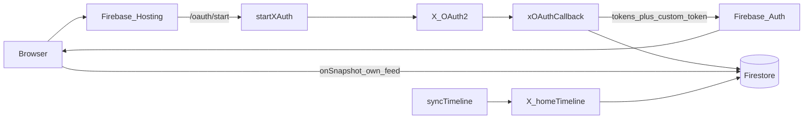

# Architecture

Private **following feeds** backed by the X API (pay-per-use), Firebase Auth (custom tokens), Firestore, Hosting, and Cloud Functions.

Forkers configure their own Firebase project and Hosting URL via local files (see [README](../README.md)); nothing in tracked source should hardcode a production project id.

## Goals

- Each member connects **their own** X account and sees **only their** home timeline (original posts + reposts, no replies).
- Access is **allowlist-first**: handles on `config/allowlist` can join. Optional invite links require `config/public.invitesEnabled === true` (**default off**). Feeds are not shared across members.
- Poll X every **10 minutes**; UI updates live via Firestore snapshots (incremental DOM updates).

## High-level flow

## Components

| Piece | Role |
|-------|------|
| [`public/`](../public/) | Static SPA: Auth gate, own feed, likes/share, favorites, author card, info dialog; admin-only usage. Firestore uses **persistent IndexedDB cache** so a reload offline can still show the last feed. A **service worker** (`sw.js`) caches the app shell + Firebase CDN modules so WebView cold starts can boot offline after one online visit |
| `android/` | Native WebView shell (Android): loads `SITE_URL`, Custom Tabs OAuth, status-link intents, FCM; uses `LOAD_CACHE_ELSE_NETWORK` when offline; returning-user session hint (`hasSession` prefs + `mt_session` cookie + document-start `has-session`) so the SPA paints chrome/cached feed before Auth restore; optional Sentry via gitignored `sentry.dsn` / `SENTRY_DSN` |
| `ios/` | Native WKWebView shell (iOS): loads `SITE_URL`, SFSafariViewController OAuth (`client=ios`), FCM+APNs, `mytwitter://` deep links; same returning-user session hint (UserDefaults + cookie + `WKUserScript` at document start); optional Sentry via gitignored `Config.xcconfig`; Release uses production APNs entitlements |
| [`fastlane/`](../fastlane/) | Homebrew Fastlane: `android beta` (Play open testing), `ios beta` (TestFlight), `beta_both` (Android then iOS). Secrets stay in env / `~/.sidekick-secrets` / ASC key path — not in git |
| `public/firebase-config.js` | Local Firebase web config (`window.FIREBASE_CONFIG`; gitignored) |
| Hosting rewrites | `/oauth/start` → `startXAuth`, `/oauth/callback` → `xOAuthCallback` |
| Cloud Functions | See exports table below; optional Sentry via `SENTRY_DSN` in `functions/.env.<projectId>` (unset ⇒ off) |
| Firestore | Members, posts, tokens (Admin-only), sync state, allowlist; web client enables `persistentLocalCache` for offline reads |
| Firebase Auth | Custom tokens only; **Auth uid = X user id** |
| X API | OAuth 2.0 user context + `GET /2/users/:id/timelines/reverse_chronological` (via `homeTimeline`) |

### Cloud Functions (`us-central1`)

| Export | Type | Purpose |
|--------|------|---------|
| `startXAuth` | HTTP | OAuth start + PKCE session; optional `?client=android` or `?client=ios` for native return |
| `xOAuthCallback` | HTTP | Token exchange, membership, custom token, post-OAuth sync; native clients redirect to `mytwitter://auth` |
| `createInvite` | Callable | Admin invite links (requires `invitesEnabled`) |
| `getAuthorCard` | Callable | Profile + `connection_status` |
| `setFollowing` | Callable | Follow / unfollow on X |
| `setLiked` | Callable | Like / unlike on X + Firestore mirror |
| `resolveTweetUrl` | Callable | Expand `t.co` / parse status URLs → tweet id |
| `getTweet` | Callable | Fetch a tweet via X API + write-through to own posts |
| `registerDevice` | Callable | Store FCM device token under `users/{uid}/devices` |
| `syncMyTimeline` | Callable | Authenticated pull-to-refresh: sync only the signed-in user (60s cooldown) |
| `syncTimeline` | Scheduler (`every 10 minutes`) | Poll all enabled users; push when favorited authors post |
| `syncNow` | HTTP `?key=` | Manual sync |

Hosting also sets `Referrer-Policy: no-referrer`. Firestore database location is `nam5` (`firebase.json`).

## Configuration

| Setting | Where |
|---------|--------|
| Firebase project id | `.firebaserc` or `FIREBASE_PROJECT_ID` |
| Hosting / OAuth origin | Functions param `SITE_URL` in `functions/.env.<projectId>` |
| Web SDK config | `public/firebase-config.js` |
| X + sync secrets | `.env` → `scripts/set-secrets.sh` → Secret Manager |
| Functions Sentry DSN | Optional `SENTRY_DSN` in gitignored `functions/.env.<projectId>` (`defineString`, default empty). Unset ⇒ reporting disabled; forks need not create any secret |
| Android site URL / Sentry DSN | `android/local.properties` (`site.url`, `sentry.dsn`) or env — never commit live values |
| iOS site URL / Sentry DSN | `ios/Config.xcconfig` (`SITE_URL`, `SENTRY_DSN`) — never commit live values |
| Friend/family invites | `config/public.invitesEnabled` (boolean; **default off** when unset) |

`SITE_URL` must match the public HTTPS origin registered in the X Developer Portal (callback = `${SITE_URL}/oauth/callback`).

## Auth and membership

1. User opens site (optionally `?invite=CODE`).
2. **Sign in with X** → Hosting `/oauth/start` → `startXAuth` stores PKCE verifier in `oauthSessions/{state}` and redirects to X.
3. X redirects to `/oauth/callback` → `xOAuthCallback`:
   - Exchanges code for access + refresh tokens.
   - Allows join if already a member, handle/`xUserId` on `config/allowlist`, or (when `invitesEnabled`) a valid invite.
   - Upserts `members/{xUserId}` and `users/{xUserId}` (tokens).
   - Mints Firebase custom token using `ADMIN_SDK_CREDENTIALS` (local private-key signing; avoids Gen2 `signBlob` IAM issues).
   - Redirects to `/?token=…`; client `signInWithCustomToken` then strips the query.
   - Starts a **fire-and-forget first sync** for that user (in addition to the 10-minute schedule).
4. Returning members re-run the same X OAuth path (refreshes API tokens + session).

**Admin:** first allowlist handle from bootstrap (`ADMIN_HANDLE`) gets `role: admin` on first join if not already set. When invites are enabled, admins call `createInvite` from the info dialog.

## Data model

| Path | Client access | Contents |
|------|---------------|----------|
| `members/{xUserId}` | Read **own** doc | `handle`, `name`, `avatar`, `role`, `enabled`, `xUserId`, `joinedAt`, `updatedAt` |
| `users/{xUserId}` | Admin only | OAuth2 tokens (`accessToken`, `refreshToken`, …), `enabled`, `authType`, profile fields; may include `accessBlocked` / `accessBlockedReason` after sync failures; legacy `oauth1` for sync-only CLI path |
| `users/{xUserId}/posts/{tweetId}` | Read **own** feed | `text`, author fields, `media[]`, `linkPreview`, `url`, `isRetweet`, repost metadata, `fetchedAt`, optional `mediaCheckedAt` |
| `users/{xUserId}/authors/{id}` | Read **own** (rules) | Cached on sync (`name`, `username`, `profileImageUrl`, `description`, `verified`, `updatedAt`); UI loads live cards via `getAuthorCard` |
| `users/{xUserId}/likes/{tweetId}` | Read **own** likes | Mirror of likes made from the site (`likedAt`) |
| `users/{xUserId}/favorites/{authorId}` | Read/write **own** | Curated watchlist (`handle`, `name`, `avatar`, `favoritedAt`); MyTwitter-only, not X bookmarks |
| `users/{xUserId}/devices/{tokenId}` | Admin only | FCM tokens (`token`, `platform`, `enabled`, `updatedAt`) |
| `users/{xUserId}/sync/state` | Admin only | `sinceId`, `lastSyncAt`, `lastManualSyncAt`, fetch/write stats, `lastError`, … |
| `config/public` | Read if member | `usage.*` (`postsReadCumulative`, `cyclePostsRead`, `pricePerPostUsd`, …), `lastRefreshedAt`, `invitesEnabled` (default `false`); legacy `defaultUid` / `defaultHandle` may exist from CLI oauth scripts |
| `config/allowlist` | Admin only | `handles[]`, `xUserIds[]` |
| `invites/{code}` | Admin only | `createdBy`, `maxUses`, `usedCount`, `expiresAt`, `active`, `createdAt`, redemption metadata |
| `oauthSessions/{state}` | Admin only | Short-lived PKCE + optional invite |

**`linkPreview` shape** (omitted or `null` when the post has attached media): `{ url, tcoUrl, expandedUrl, displayUrl, domain, title, description, imageUrl }`. Stored/display text omits the card URL when a preview is present.

Rules: [`firestore.rules`](../firestore.rules) — no world-readable posts.

## Sync

- **Post-OAuth:** `xOAuthCallback` kicks off an immediate background sync for the new/returning user.
- **`syncMyTimeline`**: Callable for the signed-in member only (SPA pull-to-refresh); 60s cooldown via `lastManualSyncAt`.
- **`syncTimeline`**: Cloud Scheduler every 10 minutes; all `users` with `enabled == true`.
- **`syncNow`**: HTTP, requires `?key=$SYNC_NOW_KEY`.
- Prefers X API v2 `homeTimeline` with `exclude=replies`, `since_id` after first sync (first sync: last 24h via `start_time`). Pagination caps: up to **5** pages when incremental, **2** on first sync.
- **Reposts:** expands `referenced_tweets.id` (+ author/media) and stores the **original** tweet’s full text (`note_tweet` when present), not the truncated `RT @user:…` field. Self-reposts (same author) are shown as normal posts.
- **Media:** stores `media[]` (`type`, preview, `videoUrl` from MP4 variants) plus `mediaUrls` thumbs. One-time backfill looks up existing video/GIF posts that only had stills.
- **Link previews:** when a post has no attached media, stores `linkPreview` from `entities.urls` / `note_tweet.entities.urls` for an X-style card.
- Falls back to v1.1 home timeline if v2 fails.
- On repeated auth failures, may set `users/{uid}.accessBlocked` + `accessBlockedReason` (not surfaced in the UI today).
- After successful syncs, updates `config/public.lastRefreshedAt` and project usage via `GET /2/usage/tweets` (cumulative across billing-cycle resets).

## Frontend behavior

- Unauthenticated: auth gate + Sign in with X.
- Authenticated: feed is always the signed-in user’s own timeline (Firestore query `limit(100)`). No member switcher.
- Feed listener uses Firestore `docChanges()` to add/update/remove cards without full `innerHTML` rebuilds.
- Video posts play inline (`<video controls>`); animated GIFs autoplay muted and loop; viewport `IntersectionObserver` pauses off-screen videos. Card tap still opens X except on video controls / links / link previews.
- Each card has **Like** (X API via `setLiked`) and **Share** (Web Share API, clipboard fallback). Liked state is mirrored under `users/{uid}/likes`.
- Link preview cards (domain, title, description, thumbnail) when `linkPreview` is present.
- Header: title, handle, relative refresh time, info, sign out on one line. Pull-to-refresh on the feed calls `syncMyTimeline`. Info dialog: status, app version, admin-only usage (cumulative + this cycle), invite button (only if `invitesEnabled`; client creates invites with `maxUses: 5`, `days: 14`).
- Author profile card (hover on desktop, tap on touch): Follow / Unfollow (`getAuthorCard`, `setFollowing`) and **Favorite** toggle (Firestore `users/{uid}/favorites`). Feed cards show a star mark for posts from favorited accounts. Follow defaults to Following until the API returns. Requires a fresh X sign-in after `follows.write` / `like.write` scopes were added.
- Deep links: `?tweet=` and `window.MyTwitterOpenTweet` open/highlight a post (or fetch via `getTweet`). Native Android/iOS shells register for push **after** a favorites-gated soft prompt (not on cold start) and open tweets from notifications / deep links.

## Secrets (Cloud Functions)

| Secret | Purpose |
|--------|---------|
| `X_CLIENT_ID` / `X_CLIENT_SECRET` | OAuth 2.0 confidential client |
| `X_API_KEY` / `X_API_SECRET` | OAuth 1.0a fallback consumer |
| `X_BEARER_TOKEN` | App-only usage API |
| `SYNC_NOW_KEY` | Gate `syncNow` |
| `ADMIN_SDK_CREDENTIALS` | Service account JSON for custom-token signing |

Pushed via [`scripts/set-secrets.sh`](../scripts/set-secrets.sh).

## Scripts

| Script | Use |
|--------|-----|
| `scripts/bootstrap-family.cjs` | Seed allowlist + admin `members` doc (`ADMIN_HANDLE` required) |
| `scripts/set-secrets.sh` | Upload Function secrets from `.env` + service account JSON |
| `scripts/x-oauth.cjs` | Local PKCE OAuth (emergency / CLI); prefer web sign-in |
| `scripts/x-oauth1-pin.cjs` | Legacy OAuth 1.0a PIN helper |
| `scripts/resolve-project.cjs` | Shared Firebase project id resolution for scripts |

## Cost model

X pay-per-use bills primarily per **post read** (~$0.005). Dedup within a 24h UTC window is handled by X. Shared meter stored on `config/public.usage` and shown in the info dialog **Admin** section only.

## Out of scope

- Google/email Auth, Firebase TwitterAuthProvider (browser OAuth 1.0a provider)
- Per-member billing / separate X apps
- Public world-readable feeds
- Shared / family-wide timeline (each member only sees their own)
- Streaming / Account Activity (not available for following timeline on this tier)

**Note:** Legacy OAuth 1.0a user tokens (`authType: oauth1`, `scripts/x-oauth1-pin.cjs`) can still sync timelines via the Admin path, but like/follow callables require OAuth 2.0 user tokens with the scopes above.
